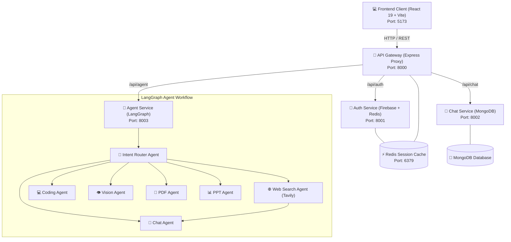

# ⚡ JettAI — Multi-Agent AI Platform

[](https://nodejs.org/)
[](https://react.dev/)
[](https://js.langchain.com/)
[](https://www.docker.com/)

**JettAI** is a scalable, distributed AI platform designed with a microservices architecture and a dynamic **LangGraph Multi-Agent** system. It intelligently classifies and routes user prompts to specialized agents (General Chat, Real-Time Web Search, Coding, Documents, and Vision) with full session persistence and an interactive React interface.

---

## 🏗️ Architecture



---

## 🌟 Key Features

- 🧠 **Dynamic Multi-Agent System**: Built with **LangChain & LangGraph** to route requests dynamically to specialized agents:
  | Agent | Status | Description |
  | :--- | :---: | :--- |
  | 🎯 **Router Agent** | 🟢 Active | Classifies user intent and delegates to the right agent node |
  | 💬 **Chat Agent** | 🟢 Active | General conversation and contextual explanations |
  | 🌐 **Search Agent** | 🟢 Active | Real-time web retrieval grounded with Tavily API |
  | 💻 **Coding Agent** | 🟡 In Development | Code generation, debugging, and syntax assistance |
  | 👁️ **Vision Agent** | 🟡 In Development | Multimodal image understanding and analysis |
  | 📄 **PDF Agent** | 🟡 In Development | Document extraction and Q&A |
  | 📊 **PPT Agent** | 🟡 In Development | Slide and presentation generation |
- ⚡ **Microservices Architecture**:
  - **API Gateway (`8000`)**: Single entry point handling request routing, auth validation, and cookie forwarding.
  - **Auth Service (`8001`)**: Firebase Admin authentication paired with Redis-backed session management.
  - **Chat Service (`8002`)**: Persistent conversation threads and message history in MongoDB.
  - **Agent Service (`8003`)**: Orchestrates LLMs (Google Gemini, Groq) and LangGraph agent pipelines.
- 🎨 **Modern Frontend**: React 19, TailwindCSS, Redux Toolkit, React Markdown with syntax-highlighted code blocks, and an Artifact preview drawer.

---

## 🛠️ Tech Stack

| Layer | Technologies |
| :--- | :--- |
| **Frontend** | React 19, Vite, TailwindCSS, Redux Toolkit, Lucide Icons, React Markdown |
| **Backend Microservices** | Node.js, Express 5, LangGraph, LangChain, `express-http-proxy` |
| **Authentication** | Firebase Admin SDK, JWT, HTTP-Only Cookie Sessions |
| **Database & Cache** | MongoDB (Mongoose), Redis (`ioredis`), Docker |
| **AI / LLMs** | Google Gemini, Groq (Llama 3), Tavily Search API |

---

## 📁 Project Structure

```
jettAI/
├── .vscode/
│   └── tasks.json                 # VS Code task runner for all services
├── backend/
│   ├── docker-compose.yml         # Redis Docker container configuration
│   ├── gateway/                   # Reverse Proxy & Auth Middleware
│   ├── shared/                    # Shared Redis client connection
│   └── services/
│       ├── auth/                  # Firebase Auth & Session Service
│       ├── chat/                  # Conversation & Message History Service
│       └── agent/                 # LangGraph Multi-Agent Orchestration
└── frontend/                      # React 19 + Vite User Interface
```

---

## 🚀 Getting Started

### 1. Prerequisites
- [Node.js](https://nodejs.org/) (v18 or higher)
- [Docker Desktop](https://www.docker.com/) (for Redis)
- [MongoDB URI](https://www.mongodb.com/) (Local or Atlas)
- API Keys: [Google AI Studio](https://aistudio.google.com/), [Groq](https://groq.com/), [Tavily](https://tavily.com/), [Firebase](https://firebase.google.com/)

---

### 2. Environment Configuration

Create a `.env` file in each respective directory:

#### **`backend/gateway/.env`**
```env
PORT=8000
AUTH_SERVICE=http://localhost:8001
CHAT_SERVICE=http://localhost:8002
AGENT_SERVICE=http://localhost:8003
FRONTEND_URL="http://localhost:5173"
REDIS_URL="redis://localhost:6379"
```

#### **`backend/services/auth/.env`**
```env
PORT=8001
MONGODB_URI="your_mongodb_connection_string"
REDIS_URL="redis://localhost:6379"
```
*(Also place your Firebase `serviceAccountKey.json` inside `backend/services/auth/`)*

#### **`backend/services/chat/.env`**
```env
PORT=8002
MONGODB_URI="your_mongodb_connection_string"
```

#### **`backend/services/agent/.env`**
```env
PORT=8003
MONGODB_URI="your_mongodb_connection_string"
REDIS_URL="redis://localhost:6379"
GROQ_API_KEY="your_groq_api_key"
GOOGLE_API_KEY="your_google_ai_key"
CHAT_SERVICE=http://localhost:8002
TAVILY_API_KEY="your_tavily_api_key"
```

#### **`frontend/.env`**
```env
VITE_API_BASE_URL="http://localhost:8000"
```

---

### 3. Installation

Install dependencies for all services:

```powershell
# Install backend service dependencies
cd backend/gateway && npm install
cd ../services/auth && npm install
cd ../chat && npm install
cd ../agent && npm install

# Install frontend dependencies
cd ../../../frontend && npm install
```

---

### 4. Running the Project

#### ⚡ **One-Shortcut Launch in VS Code (Pre-configured via `.vscode/tasks.json`)**
This repository includes a pre-configured [`.vscode/tasks.json`](.vscode/tasks.json) build task. 

Simply press:
```
Ctrl + Shift + B
```
*(Or click **Terminal** in top menu $\rightarrow$ **Run Build Task...** $\rightarrow$ **Start All Services**)*

VS Code will automatically spin up **6 dedicated tabs** in your integrated terminal drawer:
1. 📑 **`Redis (Docker 6379)`** — Runs `docker compose up` to start Redis
2. 📑 **`Auth Service (8001)`** — Runs `npm run dev`
3. 📑 **`Chat Service (8002)`** — Runs `npm run dev`
4. 📑 **`Agent Service (8003)`** — Runs `npm run dev`
5. 📑 **`Gateway (8000)`** — Runs `npm run dev`
6. 📑 **`Frontend (5173)`** — Runs `npm run dev`

---

#### 💻 **Manual Launch (Alternative)**

If not using VS Code, you can run each service in separate terminal windows:

```powershell
# 1. Start Redis
cd backend && docker compose up -d

# 2. Auth Service (Port 8001)
cd backend/services/auth && npm run dev

# 3. Chat Service (Port 8002)
cd backend/services/chat && npm run dev

# 4. Agent Service (Port 8003)
cd backend/services/agent && npm run dev

# 5. Gateway (Port 8000)
cd backend/gateway && npm run dev

# 6. Frontend (Port 5173)
cd frontend && npm run dev
```

Open **[http://localhost:5173](http://localhost:5173)** in your browser to start using JettAI!

---

## 📜 License
This project is open source and available under the [ISC License](LICENSE).

