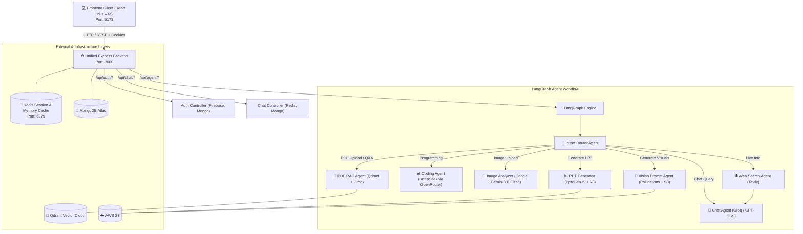

# ⚡ JettAI — Multi-Agent AI Platform

[](https://nodejs.org/)
[](https://react.dev/)
[](https://js.langchain.com/)
[](https://www.docker.com/)
[](https://aws.amazon.com/s3/)
[](https://qdrant.tech/)

**JettAI** is a scalable, distributed AI platform architected with microservices and a dynamic **LangGraph Multi-Agent** engine. It autonomously classifies and routes user prompts to specialized AI agents—spanning conversational assistance, real-time web search, production-grade coding, multimodal vision analysis, RAG-powered PDF document Q&A, and on-demand PDF & PowerPoint presentation generation with cloud storage.

---

## 📚 Table of Contents

- [System Architecture](#system-architecture)
- [Multi-Agent Capabilities](#multi-agent-capabilities)
- [Core Features](#core-features)
- [Tech Stack](#tech-stack)
- [Project Structure](#project-structure)
- [Getting Started](#getting-started)

- [License](#license)

---

## 🏗️ System Architecture <a id="system-architecture"></a>



---

## 🤖 Multi-Agent Capabilities <a id="multi-agent-capabilities"></a>

| Agent | Engine / Model | Trigger / Role | Output / Storage |
| :--- | :--- | :--- | :--- |
| 🎯 **Router Agent** | ChatGroq | Classifies user intent or inspects attachments to route the query | Dispatches to target agent node |
| 💬 **Chat Agent** | ChatGroq (`openai/gpt-oss-20b`) | General conversations, explanations, and synthesized answers | Markdown formatting with sliding window memory |
| 🌐 **Search Agent** | Tavily Search API + ChatGroq | Real-time queries needing current, live web data | Search results & image citations fed into Chat Agent |
| 💻 **Coding Agent** | ChatOpenRouter (`deepseek/deepseek-chat`) | System architecture, debugging, clean code generation | Production-grade code blocks with file path headers |
| 👁️ **Image Analyzer** | ChatGoogleGenerativeAI (`gemini-3.6-flash`) | Multimodal analysis of uploaded images (charts, text, photos) | Grounded visual analysis strictly based on image |
| 📑 **PDF RAG Agent** | Qdrant Cloud + ChatGroq | Semantic Q&A over uploaded PDF documents | Embeds chunks into Qdrant vector collection for retrieval |
| 📊 **PPT Generator** | ChatGroq + PptxGenJS | Multi-slide presentation creation with tailored slide layouts | Uploads to AWS S3; returns presigned download link |
| 🎨 **Vision Agent** | ChatGroq + Pollinations.ai | Transforms descriptive ideas into 8K photo-realistic image prompts | Generates image, uploads to S3, returns download link |

---

## 🌟 Core Features <a id="core-features"></a>

- ⚡ **Unified Monolithic Architecture**:
  - **Single Express Backend (`Port 8000`)**: Streamlined Node.js server handling authentication, chat history, and agent orchestration without network overhead.
  - **Auth & Chat Integrations**: Handles Google Sign-In with Firebase, Redis session caching, and unified MongoDB Atlas persistence for users, threads, and messages.
  - **LangGraph Multi-Agent Engine**: Stateful orchestration of multi-step AI agents and multimodal execution graphs natively within the core backend.
- 🧠 **Two-Tier Smart Memory System**:
  - In-memory Redis buffer caching the last 20 messages for instantaneous conversational response times.
  - Automatic fallback to MongoDB Atlas for cold-start history retrieval.
  - Sliding-window token estimation (`MAX_HISTORY_TOKENS = 2000`) ensuring prompts stay within model context bounds.
- 🎯 **RAG (Retrieval-Augmented Generation) & Vector Database**:
  - Full semantic search for PDF documents using text splitters and **Qdrant Vector Cloud**.
  - Document lifecycle management with active/inactive status and vector collection cleanup.
- ☁️ **Cloud Storage Integration**:
  - Generated PDFs, presentations, and images are streamed directly to **AWS S3** with time-expiring presigned download URLs.
- 📱 **Fully Responsive UI**:
  - Built with React 19, TailwindCSS, and Redux Toolkit.
  - Fully optimized for Mobile (320px+), Tablet (640px+), and Desktop (1024px+) viewports.
  - Collapsible sidebar, interactive agent selector, code copy utilities, and Markdown rendering.

---

## 🛠️ Tech Stack <a id="tech-stack"></a>

| Layer | Technologies |
| :--- | :--- |
| **Frontend** | React 19, Vite 8, TailwindCSS 4, Redux Toolkit, Lucide Icons, React Markdown |
| **Backend Framework** | Node.js (ES Modules), Express 5, Multer |
| **Agent Orchestration** | `@langchain/langgraph`, `@langchain/core`, `@langchain/groq`, `@langchain/google-genai`, `@langchain/openrouter` |
| **Authentication** | Firebase Admin SDK, Redis Session Store, HTTP-Only Cookie Sessions |
| **Databases & Storage** | MongoDB Atlas (Mongoose), Redis (`ioredis`), Qdrant Vector Cloud (`@langchain/qdrant`), AWS S3 (`@aws-sdk/client-s3`) |
| **Document Processing** | PDFParse, PDFKit, PptxGenJS |
| **External APIs** | Groq, Google Gemini API, OpenRouter, Tavily Search API, Pollinations.ai |

---

## 📁 Project Structure <a id="project-structure"></a>

```
jettAI/
├── .vscode/
│   └── launch.json                      # VS Code Debugger configuration
├── backend/
│   ├── docker-compose.yml               # Redis Docker configuration
│   ├── index.js                         # Main Express server (Port 8000)
│   ├── agents/                          # LangGraph agent definitions
│   ├── config/                          # Firebase, LLM models, DB, S3, Qdrant
│   ├── controllers/                     # Core logic for auth, chat, agents
│   ├── graph/                           # LangGraph state annotations & router
│   ├── middleware/                      # Auth protect & rate limiting logic
│   ├── models/                          # Mongoose schemas (User, Message, etc.)
│   ├── routes/                          # API route definitions
│   └── utils/                           # Helper utilities (S3, tokens, etc.)
└── frontend/                            # React 19 + Vite Frontend (Port 5173)
    ├── src/
    │   ├── components/                  # UI Components (ChatArea, Nav, etc.)
    │   ├── features/                    # API client functions
    │   ├── pages/                       # Main pages
    │   └── redux/                       # Redux store slices
```

---

## 🚀 Getting Started <a id="getting-started"></a>

### 1. Prerequisites
- [Node.js](https://nodejs.org/) (v20 or higher recommended)
- [Docker Desktop](https://www.docker.com/) (for local Redis)
- [MongoDB Atlas](https://www.mongodb.com/) cluster URI
- API Keys:
  - [Groq API](https://groq.com/)
  - [Google AI Studio](https://aistudio.google.com/)
  - [OpenRouter](https://openrouter.ai/)
  - [Tavily Search](https://tavily.com/)
  - [Firebase Console](https://firebase.google.com/)
  - [AWS S3](https://aws.amazon.com/s3/) (Bucket + Access Keys)
  - [Qdrant Cloud](https://cloud.qdrant.io/) (Cluster URL + API Key)

---

### 2. Environment Configuration

Create a `.env` file in the `backend/` directory:

#### **`backend/.env`**
```env
PORT=8000
MONGODB_URI="your_mongodb_atlas_uri"
REDIS_URL="redis://localhost:6379"
FRONTEND_URL="http://localhost:5173"

# AI & API Keys
GROQ_API_KEY="your_groq_api_key"
GOOGLE_API_KEY="your_google_api_key"
OPENROUTER_API_KEY="your_openrouter_api_key"
TAVILY_API_KEY="your_tavily_api_key"

# AWS S3 Storage
AWS_REGION="your_aws_region"
AWS_ACCESS_KEY_ID="your_aws_access_key"
AWS_SECRET_KEY="your_aws_secret_key"
AWS_BUCKET_NAME="your_s3_bucket_name"

# Qdrant Vector Cloud
QDRANT_URL="your_qdrant_cloud_cluster_url"
QDRANT_API_KEY="your_qdrant_api_key"
```
*(Also place your Firebase `serviceAccountKey.json` directly inside the `backend/` directory)*

#### **`frontend/.env`**
```env
VITE_FIREBASE_API_KEY="your_firebase_web_api_key"
VITE_SERVER_URL="http://localhost:8000"
```

---

### 3. Installation

Install dependencies for the frontend and backend:

```powershell
# Backend
cd backend && npm install

# Frontend
cd ../frontend && npm install
```

---

### 4. Running the Services

#### 🚀 **One-Shortcut Launch in VS Code (Pre-configured via `.vscode/launch.json`)**
This repository includes a pre-configured `.vscode/launch.json` debugger configuration.

Simply press:
```
F5
```
*(Or navigate to the **Run and Debug** tab in VS Code and hit **Play**)*

VS Code will automatically:
1. Launch the Frontend in a background terminal.
2. Launch and attach the debugger to the Backend Express Server on Port 8000.

---

#### 💻 **Manual Launch**

If running manually, start each component in a separate terminal:

```powershell
# 1. Start Redis container (Optional if using cloud Redis)
cd backend && docker compose up -d

# 2. Start Unified Backend Server (8000)
cd backend && npm run dev

# 3. Start Frontend (5173)
cd frontend && npm run dev
```

Open **[http://localhost:5173](http://localhost:5173)** in your browser to start chatting with JettAI!

---

## 📜 License <a id="license"></a>
This project is open source and available under the [ISC License](LICENSE).
